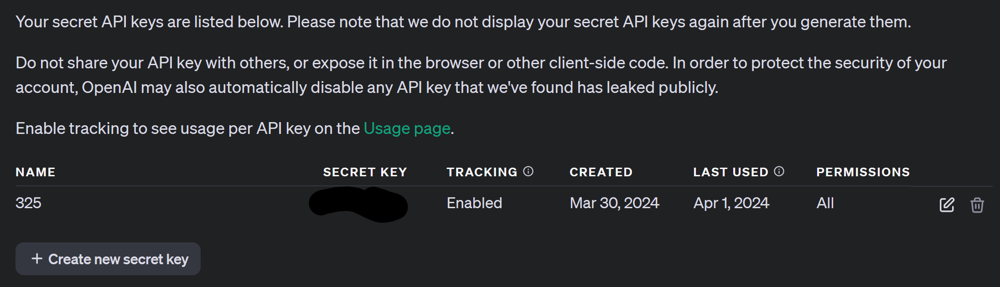

# Website Scrapper
This program uses the requests and the BeautifulSoup modules to grab a websites hTML, scrapes it, then uses openAI to generate a title and summarize it to 50 words.

## How to install the environment
1. Download the requirements.yaml
2. From the command line, import the environment using conda:
```console
conda env create --name my-new-env --file requirements.yml
```
## How to create an openAI account and API key for the program
For this program to work, you'll need to have an api key. To do this you'll first need to create an account with openai. 
1. Follow this [link](https://auth0.openai.com/u/login/identifier?state=hKFo2SBzN2dneVh4anlUN3lLQ0g2U3o2U3BVXzFlRzE4XzMxQqFur3VuaXZlcnNhbC1sb2dpbqN0aWTZIGhQRGNJZGVxR29nazhpdmJvSldBQjVQNWU0Yk1HMndWo2NpZNkgRFJpdnNubTJNdTQyVDNLT3BxZHR3QjNOWXZpSFl6d0Q)
2. Create/log-in to your account
3. Go to API keys
   
4. Click "Create new secret key", and give it a name
5. Save the key for later use in this program

## How to run the program
1. Open up the environment
   1. You want activate the new environment from the command line as followed:
```console
conda activate my-new-env
```
2. Replace the 'raw/articles.text' with your articles text file
```python
with open('Data/raw/articles.text','r') as file:
    urls = file.readlines()
```
The raw/ is there because you should save your article text file inside the raw folder

3. Create an .env file inside the root directory folder (CS325_P2)
   1. Inside the .env file, write out the following code:
```console
OPENAI_API_KEY="YOUR_API_KEY"
```

4. From inside the activated environment, run the python program:
```console
python websiteScrapper.py
```
5. The new scrapped web articles will be inside the processed file
